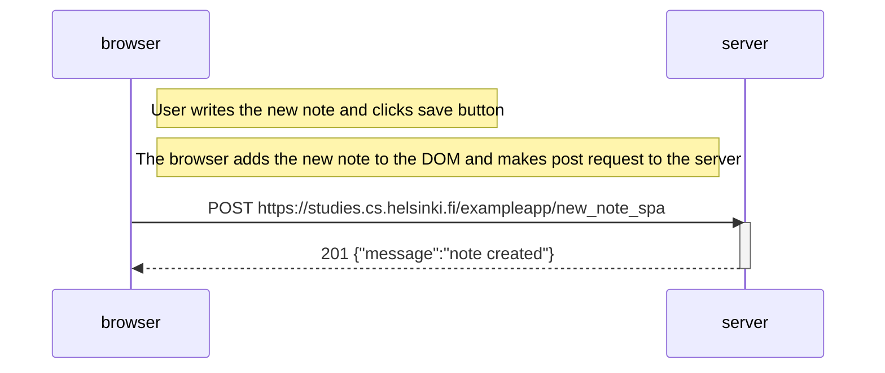

```mermaid
sequenceDiagram
    participant browser
    participant server
    
    Note right of browser: User writes the new note and clicks save button
    
    # User writes the new note and clicks save button
    Note right of browser: The browser adds the new note to the DOM and makes post request to the server
    browser->>server: POST https://studies.cs.helsinki.fi/exampleapp/new_note_spa
    activate server
    # The server add the new note and returns success message
    server-->>browser: 201 {"message":"note created"}
    deactivate server
```
