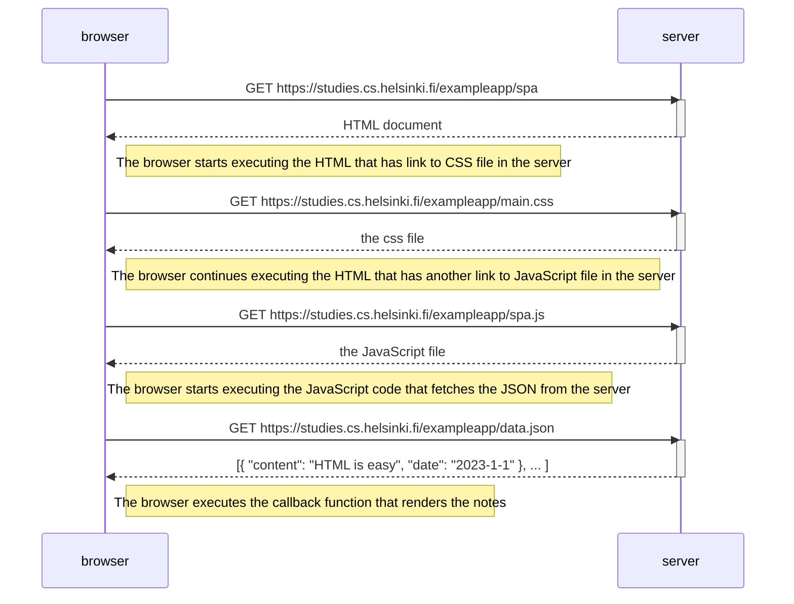

```mermaid
sequenceDiagram
    participant browser
    participant server
    
    # The browser request get notes from the server
    browser->>server: GET https://studies.cs.helsinki.fi/exampleapp/spa
    activate server
    # The server sends the html file
    server-->>browser: HTML document
    deactivate server
    
    Note right of browser: The browser starts executing the HTML that has link to CSS file in the server
    
    # The browser parse through the html file and finds link to css file which will make the browser another request for the css file
    browser->>server: GET https://studies.cs.helsinki.fi/exampleapp/main.css
    activate server
    # The server sends the css file to the browser
    server-->>browser: the css file
    deactivate server
    
    Note right of browser: The browser continues executing the HTML that has another link to JavaScript file in the server
    
    # The browser continues to read the html and encounters another link to javascript file and make another request for that one too
    browser->>server: GET https://studies.cs.helsinki.fi/exampleapp/spa.js
    activate server
    # The server responds with javascript file
    server-->>browser: the JavaScript file
    deactivate server
    
    Note right of browser: The browser starts executing the JavaScript code that fetches the JSON from the server
    
    browser->>server: GET https://studies.cs.helsinki.fi/exampleapp/data.json
    activate server
    server-->>browser: [{ "content": "HTML is easy", "date": "2023-1-1" }, ... ]
    deactivate server    

    Note right of browser: The browser executes the callback function that renders the notes 
```
